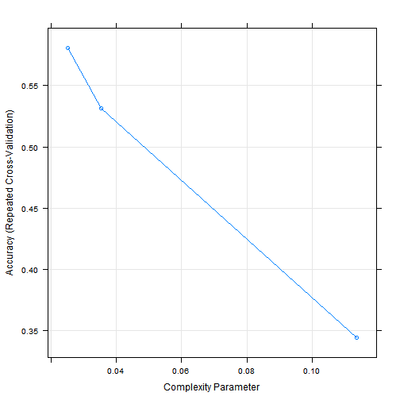
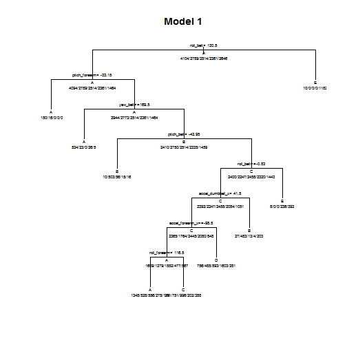
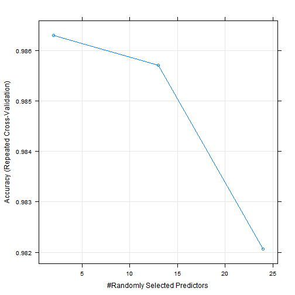

# Report: Machine Learning: Prediction of activity tracking
# Date: 2015/10/25
# Name: Jorge Chong
========================================================


## Introduction

For this report we are going to train a model using data from a study called:

*Ugulino, W.; Cardador, D.; Vega, K.; Velloso, E.; Milidiu, R.; Fuks, H. Wearable Computing: Accelerometers' Data Classification of Body Postures and Movements. Proceedings of 21st Brazilian Symposium on Artificial Intelligence. Advances in Artificial Intelligence - SBIA 2012. In: Lecture Notes in Computer Science. , pp. 52-61. Curitiba, PR: Springer Berlin / Heidelberg, 2012. ISBN 978-3-642-34458-9. DOI: 10.1007/978-3-642-34459-6_6.* 

Read more: [http://groupware.les.inf.puc-rio.br/har#ixzz3pb7Y1yRA] (http://groupware.les.inf.puc-rio.br/har#ixzz3pb7Y1yRA)

The study is an attempt in human activity recognition research. The study data consists of data from 4 sensors (belt, arm, forearm, and dumbell) for four participants and tries to classify 5 types of activities: Sitting, Sitting down, Standing, Standing up, and Walking.

## Processing the Data

In the study is mentioned that data is collected during 8 hours of activities, 2 hours, each of the subjects. Data is generated in windows of 1 sec, with 150 ms overlapping. Every change in window there are added some statistics of the windows like mean, std, kurtosis, etc. It's a good idea to delete the rows with **new_window == no**


## Feature Selection

We have to delete all columns that refer to window statistics. Also the study specifies that they used a feature selection algorithm: Mark Hall's selection algorithm, which is based in correlation. Based on features selected in the study, we will select this features:

* roll_belt
* pitch_belt
* yaw_belt
* accel_belt_x
* accel_belt_y
* accel_belt_z
* roll_arm
* pitch_arm
* yaw_arm
* accel_arm_x
* accel_arm_y
* accel_arm_z
* roll_dumbbell
* pitch_dumbbell
* yaw_dumbbell
* accel_dumbbell_x
* accel_dumbbell_y
* accel_dumbbell_z
* roll_forearm
* pitch_forearm
* yaw_forearm
* accel_forearm_x
* accel_forearm_y
* accel_forearm_z

Notice that the study selects the module of acceleration for some sensors, but we will use the x, y, z components directly to train the model


```r
c_training <- c("roll_belt",
                "pitch_belt",
                "yaw_belt",
                "accel_belt_x",
                "accel_belt_y",
                "accel_belt_z",
                "roll_arm",
                "pitch_arm",
                "yaw_arm",
                "accel_arm_x",
                "accel_arm_y",
                "accel_arm_z",
                "roll_dumbbell",
                "pitch_dumbbell",
                "yaw_dumbbell",
                "accel_dumbbell_x",
                "accel_dumbbell_y",
                "accel_dumbbell_z",
                "roll_forearm",
                "pitch_forearm",
                "yaw_forearm",
                "accel_forearm_x",
                "accel_forearm_y",
                "accel_forearm_z",
                "classe"
                )

c_testing <- c("roll_belt",
                "pitch_belt",
                "yaw_belt",
                "accel_belt_x",
                "accel_belt_y",
                "accel_belt_z",
                "roll_arm",
                "pitch_arm",
                "yaw_arm",
                "accel_arm_x",
                "accel_arm_y",
                "accel_arm_z",
                "roll_dumbbell",
                "pitch_dumbbell",
                "yaw_dumbbell",
                "accel_dumbbell_x",
                "accel_dumbbell_y",
                "accel_dumbbell_z",
                "roll_forearm",
                "pitch_forearm",
                "yaw_forearm",
                "accel_forearm_x",
                "accel_forearm_y",
                "accel_forearm_z"
                )

tmp_training <- tmp_training[,c_training]
tmp_testing <- tmp_testing[,c_testing]
```

Also we check for further covariates:


```r
n <- nearZeroVar(tmp_training, saveMetrics= TRUE)
print(n)
```

```
##                  freqRatio percentUnique zeroVar   nzv
## roll_belt         1.086168    6.83805162   FALSE FALSE
## pitch_belt        1.036649    9.53892590   FALSE FALSE
## yaw_belt          1.047244   10.10616153   FALSE FALSE
## accel_belt_x      1.059367    0.85345545   FALSE FALSE
## accel_belt_y      1.115333    0.74417152   FALSE FALSE
## accel_belt_z      1.080702    1.55599500   FALSE FALSE
## roll_arm         51.153846   13.75936719   FALSE FALSE
## pitch_arm        85.282051   15.96065779   FALSE FALSE
## yaw_arm          32.281553   14.89904246   FALSE FALSE
## accel_arm_x       1.017751    4.04350541   FALSE FALSE
## accel_arm_y       1.169082    2.78413822   FALSE FALSE
## accel_arm_z       1.139344    4.12156536   FALSE FALSE
## roll_dumbbell     1.037879   84.17464613   FALSE FALSE
## pitch_dumbbell    2.248175   81.73397169   FALSE FALSE
## yaw_dumbbell      1.132231   83.34721066   FALSE FALSE
## accel_dumbbell_x  1.006061    2.21169858   FALSE FALSE
## accel_dumbbell_y  1.062500    2.41985845   FALSE FALSE
## accel_dumbbell_z  1.150215    2.12323064   FALSE FALSE
## roll_forearm     11.726154   11.23542881   FALSE FALSE
## pitch_forearm    64.576271   15.09679434   FALSE FALSE
## yaw_forearm      15.236000   10.29870941   FALSE FALSE
## accel_forearm_x   1.142857    4.13197336   FALSE FALSE
## accel_forearm_y   1.050000    5.20920067   FALSE FALSE
## accel_forearm_z   1.019231    3.01311407   FALSE FALSE
## classe            1.471490    0.02601998   FALSE FALSE
```


## Model selection

First we use a partition of 75% for training and 25% for testing, and specify a training control using repeated k-fold cross validation, where k = 4 and two repetitions per fold.


```r
inTraining <- createDataPartition(tmp_training$classe, p = .75, list = FALSE)
training <- tmp_training[inTraining, ]
testing <- tmp_training[-inTraining, ]
control <- trainControl(method = "repeatedcv", number = 4, repeats = 2)
```

Our first model will be a decision tree using rpart.


```r
knitr::opts_chunk$set(cache=TRUE)
set.seed(3923)
model1 <- train(classe~., data = training, trControl = control, method = "rpart")
```

```
## Loading required package: rpart
```

```r
print(model1, digits=3)
```

```
## CART 
## 
## 14414 samples
##    24 predictor
##     5 classes: 'A', 'B', 'C', 'D', 'E' 
## 
## No pre-processing
## Resampling: Cross-Validated (4 fold, repeated 2 times) 
## Summary of sample sizes: 10811, 10811, 10809, 10811, 10812, 10811, ... 
## Resampling results across tuning parameters:
## 
##   cp      Accuracy  Kappa   Accuracy SD  Kappa SD
##   0.0251  0.581     0.4651  0.0144       0.0168  
##   0.0352  0.532     0.3976  0.0697       0.1140  
##   0.1137  0.344     0.0915  0.0369       0.0566  
## 
## Accuracy was used to select the optimal model using  the largest value.
## The final value used for the model was cp = 0.0251.
```

```r
print(model1$finalModel, digits=3)
```

```
## n= 14414 
## 
## node), split, n, loss, yval, (yprob)
##       * denotes terminal node
## 
##   1) root 14414 10300 A (0.28 0.19 0.17 0.16 0.18)  
##     2) roll_belt< 130 13222  9130 A (0.31 0.21 0.19 0.18 0.11)  
##       4) pitch_forearm< -33.2 1166    16 A (0.99 0.014 0 0 0) *
##       5) pitch_forearm>=-33.2 12056  9110 A (0.24 0.23 0.21 0.2 0.12)  
##        10) yaw_belt>=170 588    54 A (0.91 0.039 0 0.044 0.0085) *
##        11) yaw_belt< 170 11468  8720 B (0.21 0.24 0.22 0.2 0.13)  
##          22) pitch_belt< -43 600    97 B (0.017 0.84 0.093 0.025 0.027) *
##          23) pitch_belt>=-43 10868  8410 C (0.22 0.21 0.23 0.21 0.13)  
##            46) roll_belt>=-0.83 10232  7770 C (0.23 0.22 0.24 0.2 0.1)  
##              92) accel_dumbbell_x< 41.5 9502  7060 C (0.25 0.19 0.26 0.22 0.089)  
##               184) accel_forearm_x>=-98.5 5484  3880 A (0.29 0.23 0.28 0.087 0.1)  
##                 368) roll_forearm< 116 2886  1540 A (0.47 0.18 0.19 0.095 0.062) *
##                 369) roll_forearm>=116 2598  1600 C (0.1 0.29 0.38 0.078 0.15) *
##               185) accel_forearm_x< -98.5 4018  2420 D (0.19 0.12 0.22 0.4 0.07) *
##              93) accel_dumbbell_x>=41.5 730   247 B (0.037 0.66 0.018 0.0055 0.28) *
##            47) roll_belt< -0.83 636   244 E (0.013 0 0 0.37 0.62) *
##     3) roll_belt>=130 1192    10 E (0.0084 0 0 0 0.99) *
```

```r
plot(model1)
```

 

```r
plot(model1$finalModel, uniform=TRUE, 
    main="Model 1")
text(model1$finalModel, use.n=TRUE, all=TRUE, cex=.5)
```

 

Using our testing subset:

```r
pred1 <- predict(model1, newdata = testing)
print(confusionMatrix(pred1, testing$classe), digits=3)
```

```
## Confusion Matrix and Statistics
## 
##           Reference
## Prediction    A    B    C    D    E
##          A 1092  229   35  148   13
##          B    4  169   16    3    6
##          C  152  335  719  407  313
##          D  116  196   68  228  144
##          E    3    0    0    0  406
## 
## Overall Statistics
##                                        
##                Accuracy : 0.544        
##                  95% CI : (0.53, 0.559)
##     No Information Rate : 0.285        
##     P-Value [Acc > NIR] : <2e-16       
##                                        
##                   Kappa : 0.424        
##  Mcnemar's Test P-Value : <2e-16       
## 
## Statistics by Class:
## 
##                      Class: A Class: B Class: C Class: D Class: E
## Sensitivity             0.799   0.1819    0.858   0.2901   0.4603
## Specificity             0.876   0.9925    0.696   0.8695   0.9992
## Pos Pred Value          0.720   0.8535    0.373   0.3032   0.9927
## Neg Pred Value          0.916   0.8349    0.959   0.8622   0.8916
## Prevalence              0.285   0.1935    0.175   0.1637   0.1837
## Detection Rate          0.227   0.0352    0.150   0.0475   0.0845
## Detection Prevalence    0.316   0.0412    0.401   0.1566   0.0852
## Balanced Accuracy       0.838   0.5872    0.777   0.5798   0.7298
```

The estimate of the accuracy is pretty low. To improve this, we will use the random forest algorithm for the second model:


```r
knitr::opts_chunk$set(cache=TRUE)
set.seed(3923)
model2 <- train(classe ~ ., data=training, method="rf", trControl=control, verbose=TRUE)
print(model2, digits=3)
```

```
## Random Forest 
## 
## 14414 samples
##    24 predictor
##     5 classes: 'A', 'B', 'C', 'D', 'E' 
## 
## No pre-processing
## Resampling: Cross-Validated (4 fold, repeated 2 times) 
## Summary of sample sizes: 10811, 10811, 10809, 10811, 10812, 10811, ... 
## Resampling results across tuning parameters:
## 
##   mtry  Accuracy  Kappa  Accuracy SD  Kappa SD
##    2    0.986     0.983  0.00239      0.00303 
##   13    0.986     0.982  0.00287      0.00364 
##   24    0.982     0.977  0.00349      0.00442 
## 
## Accuracy was used to select the optimal model using  the largest value.
## The final value used for the model was mtry = 2.
```

```r
plot(model2)
```

 

And using our testing subset:


```r
pred2 <- predict(model2, newdata = testing)
cf <- confusionMatrix(pred2, testing$classe)
print(cf, digits = 3)
```

```
## Confusion Matrix and Statistics
## 
##           Reference
## Prediction    A    B    C    D    E
##          A 1361    8    0    0    0
##          B    3  916    8    0    0
##          C    3    5  824   10    3
##          D    0    0    6  776    0
##          E    0    0    0    0  879
## 
## Overall Statistics
##                                         
##                Accuracy : 0.99          
##                  95% CI : (0.987, 0.993)
##     No Information Rate : 0.285         
##     P-Value [Acc > NIR] : <2e-16        
##                                         
##                   Kappa : 0.988         
##  Mcnemar's Test P-Value : NA            
## 
## Statistics by Class:
## 
##                      Class: A Class: B Class: C Class: D Class: E
## Sensitivity             0.996    0.986    0.983    0.987    0.997
## Specificity             0.998    0.997    0.995    0.999    1.000
## Pos Pred Value          0.994    0.988    0.975    0.992    1.000
## Neg Pred Value          0.998    0.997    0.996    0.998    0.999
## Prevalence              0.285    0.193    0.175    0.164    0.184
## Detection Rate          0.283    0.191    0.172    0.162    0.183
## Detection Prevalence    0.285    0.193    0.176    0.163    0.183
## Balanced Accuracy       0.997    0.992    0.989    0.993    0.998
```

This give us an improved accuracy of **0.99**, therefore our best estimate of the out of sample error is **0.01**

With this model, we find our prediction for the 20 cases in the dataset provided:


```r
print(predict(model2, newdata=tmp_testing))
```

```
##  [1] B A B A A E D B A A B C B A E E A B B B
## Levels: A B C D E
```

## Conclusion

Training the dataset with the random forest algorithm we get a pretty accurate estimate.
